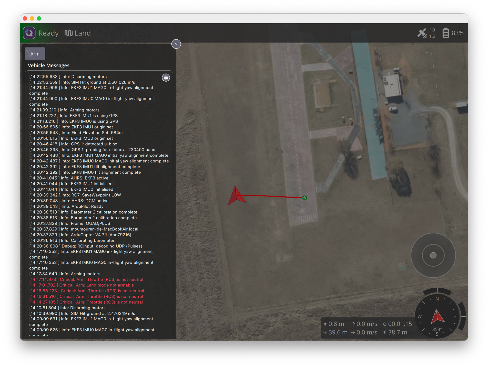

# W01 飛行原理

## 學到什麼

**核心一句話**：四個馬達轉速不同，機身就會傾斜或轉向，傾斜之後就往那個方向飛。

### 四個控制量

| 詞 | 意思 | 動作 |
|---|---|---|
| Throttle（油門） | 四個馬達一起加速或減速 | 上升、下降 |
| Roll（翻滾） | 機身左右傾斜 | 往左或往右飛 |
| Pitch（俯仰） | 機身前後傾斜 | 往前或往後飛 |
| Yaw（偏航） | 機身原地水平轉圈 | 改變機頭朝向 |

四個馬達中，兩個順時針、兩個逆時針，轉動力互相抵消，機身才不會自旋；要 yaw 時就是故意讓兩組轉速不同。編號與方向不必背，飛控會自己算。

### 飛行模式：飛控幫多少

| 模式 | 飛控做什麼 | 人或程式做什麼 |
|---|---|---|
| Stabilize | 只維持機身水平 | 自己控制高度與位置 |
| AltHold | 再加定高 | 位置會被風吹走，要自己修正 |
| Loiter | 再加定點（靠 GPS） | 人推桿移動，放開就停住 |
| Guided | 接受程式或地圖的「去那裡」指令 | 寫程式主要用這個 |
| Land | 自己降落 | — |
| RTL（Return To Launch） | 飛回起飛點並降落 | — |

口訣：Stabilize 穩姿勢 → AltHold 加定高 → Loiter 加定點 → Guided 換程式指揮。

### 其他名詞

- **Arm / Disarm**：解鎖／上鎖。沒 arm 前馬達不會轉。
- **Telemetry（遙測）**：無人機回傳的資料，如高度、姿態、電量。
- **EKF**：綜合多種感測器，估算位置與姿態的演算法（之後再深入）。
- **GPS 衛星數**：QGC 右上角的數字，越多定位越準。

### 實測紀錄（W3 時順便觀察）

- 判斷是否在空中，要看 `EXTENDED_SYS_STATE.landed_state` 與馬達輸出，不能只看單一高度數字。
- Stabilize 懸停時沒有定高；用 pymavlink 切 Land（模式編號 9）後，3 公尺約 15 秒平穩降到 0。

## 實驗：有風時比較 AltHold、Loiter、Stabilize

腳本：[`scripts/w1_modes.py`](../../appendix/scripts/w1_modes.md)（先執行 [`scripts/sitl.sh`](../../appendix/scripts/sitl.md)，QGC 用來觀察）。流程：Guided 起飛到 10 m → 開風 5 m/s → 用 RC override 把搖桿全放中間（油門 1500）→ 依序切模式，每秒記錄。

| 模式 | 高度 | 水平漂移 | 解讀 |
|---|---|---|---|
| AltHold（15 秒） | 穩在 10.0 m | 22.7 m，持續增加 | 只顧高度，位置被風帶走 |
| Loiter（15 秒） | 穩在 10.0 m | 約 1.6 m，起初被推 1.4 m 後釘住 | 靠 GPS 把位置拉回來 |
| Stabilize（10 秒） | 慢慢升到 11.4 m | 11.9 m | 高度、位置都不管；油門 1500 略高於懸停油門，所以往上爬 |

QGC 截圖（降落後）：紅線從 Home（綠色圖示）一路延伸到左側，離 Home 39.6 m，是 AltHold 與 Stabilize 兩段被風吹走的累積結果。左側 Vehicle Messages 的紅字 `Arm: Throttle (RC3) is not neutral` 就是解鎖被拒絕的訊息。

### 實驗中學到的

- **手控模式會讀虛擬遙控器**：SITL 預設油門 1000（最低）。切到 AltHold 若沒人撥油門，會被當成「油門拉到底」而降落，看起來像墜毀，其實不是。Guided 不讀遙控器，所以起飛時沒事。
- **RC override 必須持續發送**（約 10 Hz），否則飛控視為遙控器斷線。
- **解鎖被拒絕**：`Arm: Throttle (RC3) is not neutral`，油門 1000 或 1500 都一樣。QGC 的 Takeoff 用強制解鎖（`MAV_CMD_COMPONENT_ARM_DISARM` 的 param2 = 21196）繞過，腳本照做；只適合模擬，實機不要用。
- **腳本要檢查結果**：第一版沒檢查解鎖是否成功、也沒有逾時，被拒絕後就一直空等；現在會檢查 `COMMAND_ACK` 並設 30 秒逾時。
- **輸出被緩衝**：背景或管線執行 Python 時要加 `-u`，否則看不到進度。
- QGC Takeoff 的預設高度只有 3 m，不是 10 m。

## 卡在哪

- 容易搞混的詞：
  - arm 與 disarm（沒有 `unarm`）
  - RTL 是 Return **To Launch**，不是 to land
  - Stabilize 不會定高也不會定點，一度以為放開搖桿會停在原地

## 自我測驗

三輪共 15 題，得 11.5 分（✅ 1 分、⚠️ 0.5 分、❌ 0 分）。

### 第一輪（3/5）

| # | 題目 | 我的回答 | 結果 | 正確答案 |
|---|---|---|---|---|
| 1 | 想讓無人機往前飛，要改變哪一個控制量？ | pitch | ✅ | pitch |
| 2 | 想讓機頭原地轉向右邊，要改變哪一個？ | yaw | ✅ | yaw |
| 3 | 為什麼四軸要兩個馬達順時針、兩個逆時針？ | 才不會原地自旋 | ✅ | 轉動力互相抵消 |
| 4 | 在 Stabilize 模式放開所有搖桿，無人機會怎樣？ | 位置、高度固定 | ❌ | 只維持機身水平；高度與位置都不固定，會被風吹走或下沉 |
| 5 | 要寫程式讓無人機飛到指定座標，最適合用哪個模式？為什麼？ | Loiter | ❌ | Guided，因為它接受程式或地圖下的「去那裡」指令；Loiter 是人推桿才會動 |

### 第二輪（4.5/5）

| # | 題目 | 我的回答 | 結果 | 正確答案 |
|---|---|---|---|---|
| 1 | 哪個模式只穩住機身水平，不管高度和位置？ | Stabilize | ✅ | Stabilize |
| 2 | Loiter 比 AltHold 多做了什麼？ | 位置 | ✅ | 定點（靠 GPS 固定位置） |
| 3 | 無人機沒有 arm（解鎖）時，推油門會怎樣？ | 沒有反應，要 unarm | ⚠️ | 馬達不會轉；要先 arm 才能轉，沒有 `unarm`，上鎖叫 disarm |
| 4 | 想讓無人機自己飛回起飛點並降落，用哪個模式？ | RTL return to land | ⚠️ | RTL，全名 Return To Launch |
| 5 | QGC 右上角的衛星數字 10 代表什麼？越大越好還是越小越好？ | 已連線的衛星數量，愈多愈好 | ✅ | 可用的 GPS 衛星數，越多定位越準 |

### 第三輪（4/5）

| # | 題目 | 我的回答 | 結果 | 正確答案 |
|---|---|---|---|---|
| 1 | 在 Stabilize 模式放開所有搖桿，無人機會怎樣？ | 維持水平 | ✅ | 維持水平；高度和位置都不管，會漂移或下沉 |
| 2 | 要寫程式讓無人機飛到指定座標，最適合用哪個模式？為什麼不是 Loiter？ | Guided；Loiter 是固定位置、高度 | ⚠️ | Guided 對；漏了關鍵理由：Loiter 要人推桿才會動，Guided 才接受程式下的「去那裡」指令 |
| 3 | 「解鎖」和「上鎖」的正式英文動詞各是什麼？ | disarm / arm | ✅ | arm（解鎖）／disarm（上鎖） |
| 4 | RTL 的全名是什麼？它做了哪兩件事？ | return to launch | ⚠️ | Return To Launch 對；漏了兩件事：飛回起飛點，然後降落 |
| 5 | 想維持固定高度，位置不用管，用哪個模式？ | althold | ✅ | AltHold |

### 需要加強

- 回答「為什麼」時要說出理由，不只是模式名稱（第三輪第 2 題）
- RTL 的行為：飛回起飛點，然後降落

### 補充：手控、電腦控、全自動

| 分類 | 模式 | 誰決定要去哪 |
|---|---|---|
| 手控 | Stabilize、AltHold、Loiter | 人推搖桿；差別只在飛控幫忙顧姿態、高度、位置多少 |
| 電腦控 | Guided | 程式或地面站給目標點（不一定是 AI，QGC 地圖上點 Go To 也算） |
| 全自動 | Land、RTL | 飛控按內建流程自己執行 |

另有 Auto 模式：按事先上傳的航點任務自動飛，W6 會用到。

## 下週問題

- 實際在 QGC 切換 Stabilize、AltHold、Loiter，差別看起來是什麼樣子？
- 飛控內部的 PID 控制迴路怎麼讓機身保持水平？
- IMU、氣壓計、GPS 各自提供什麼資訊給 EKF？
