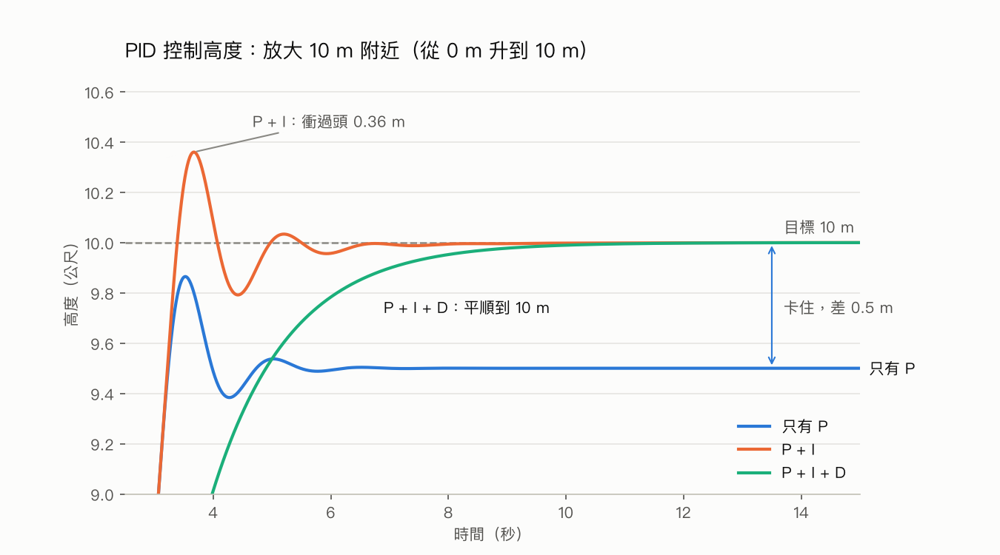
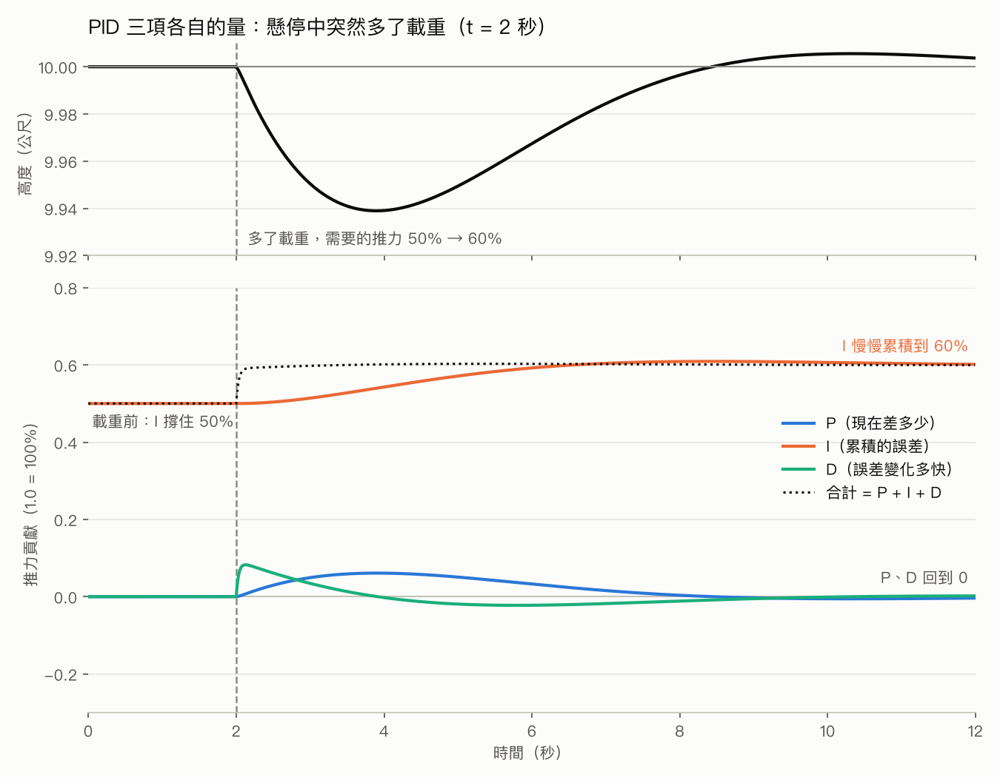
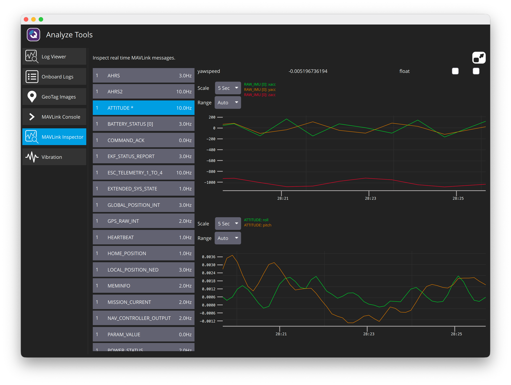

# W02 飛控架構

## 本週要知道

學完能回答：**無人機為什麼能自己保持水平、定高、抗風？**

1. **資料流**：感測器 → 估算（EKF）→ 控制（PID）→ 馬達。
2. **四種感測器各測什麼**：
   - IMU（陀螺儀 + 加速度計）：旋轉速度與加速度
   - 氣壓計：高度
   - GPS：位置
   - 磁力計：朝向
3. **EKF 的用途**：感測器都有雜訊，EKF 把它們融合成「我在哪、朝哪」的最佳估計。不用懂數學。
4. **PID 的用途**：誤差越大修正越多（P）、長期偏差慢慢消除（I）、抑制過衝（D）。
5. **控制是分層的**：飛行模式決定目標 → 姿態控制算目標轉速 → 轉速控制（PID）算推力 → 馬達混控分給四個馬達。
6. **W1 現象對應的原因**：
   - AltHold 定高：氣壓計加高度 PID
   - Loiter 抗風：GPS 加位置 PID
   - Stabilize 不定高：沒有高度控制這一層
7. **ArduPilot 與 PX4 同類**：都是開源飛控，架構相近；本計畫用 ArduPilot。

### 兩條鏈：資料流與控制分層

兩條鏈講的是同一件事的不同縮放層級：第二條是第一條「控制」那一段的展開。

```
資料流（誰把什麼交給誰）
  感測器 ──▶ EKF ──▶ PID ──▶ 馬達
            估算      控制
         「我在哪、朝哪」  「該出多少力」
                       │
                       ▼ 放大「控制」這一段
控制分層（目標怎麼變成馬達指令）
  飛行模式 ──▶ 姿態控制 ──▶ 轉速控制（PID）──▶ 馬達混控 ──▶ PWM
  去哪裡      要傾斜多少    要轉多快           各馬達多少    送出訊號
```

- EKF 屬於「估算」，只出現在第一條，不在控制分層裡。
- 題目問「資料流」就從感測器答起；問「控制分層」就從飛行模式答起。

### 縮寫

| 縮寫 | 全名 |
|---|---|
| EKF | Extended Kalman Filter（擴展卡爾曼濾波器） |
| PID | Proportional–Integral–Derivative（比例－積分－微分） |
| IMU | Inertial Measurement Unit（慣性測量單元） |
| SITL | Software In The Loop |
| PX4 | 非縮寫，源自 PIXHAWK 計畫 |

### 可以跳過

- 原始碼函式名稱（如 `angle_ef_roll_pitch_rate_ef_yaw()`）
- 單位換算（centi-degree、cm/s）
- Kalman Filter 的數學推導
- PID 調校參數細節（W10 才用）

## 閱讀清單

**必讀**（約 1.5 小時）

1. EKF 概觀：<https://ardupilot.org/copter/docs/common-apm-navigation-extended-kalman-filter-overview.html>：看文字，知道它融合了哪些感測器就好
2. PID 調校入門：<https://ardupilot.org/copter/docs/ac_rollpitchtuning.html>：只看 P、I、D 各自的作用，參數先略過

**選讀**

- 姿態控制（開發者視角）：<https://ardupilot.org/dev/docs/apmcopter-programming-attitude-control-2.html>：只看「分層流水線」的概念，圖是原始碼呼叫路徑，看不懂正常
- 位置控制與導航：<https://ardupilot.org/dev/docs/code-overview-copter-poscontrol-and-navigation.html>
- PX4 控制器架構圖（對照用）：<https://docs.px4.io/main/en/flight_stack/controller_diagrams.html>

## 實作

1. 在 SITL 靜止時，用 pymavlink 讀 `RAW_IMU`、`SCALED_PRESSURE`、`GPS_RAW_INT`，印出原始感測器值
2. 再讀 `ATTITUDE`，比較原始值與 EKF 估算結果
3. 觀察 IMU 靜止時的雜訊大小（結果見「學到什麼」）

## 學到什麼

### IMU 不等於陀螺儀

IMU（慣性測量單元）= **陀螺儀 + 加速度計**。ArduPilot 通常把磁力計獨立計算。

| 元件 | 測什麼 | 特性 |
|---|---|---|
| 陀螺儀 | 旋轉速度（°/秒） | 短時間很準，長時間會漂移 |
| 加速度計 | 加速度（含重力） | 長期可靠（重力永遠向下），短時間雜訊大 |
| 磁力計 | 磁場方向（朝向） | 像指南針 |

兩者特性互補，EKF 把它們融合起來。

### PID：以「升到 10 m 並停住」為例

- **P（比例）**：誤差越大，推力越大。
  - 問題：差 0.5 m 時，P 算出的推力剛好只夠撐住機身，誤差再縮小推力就不夠，所以停在差 0.5 m 的地方到不了目標（穩態誤差）；而且接近目標時速度仍快，會衝過頭、來回震盪。
- **I（積分）**：累積誤差。
  - 還差 0.5 m 時，I 項每一瞬間都多加一點，越積越大，直到推力夠、誤差變 0 才停止增加。此時 I 項的值就是「撐住機身的基本推力」。
  - 比喻：定速巡航上坡時速度掉了一點，I 會一直補油門，直到回到設定速度。
- **D（微分）**：看誤差變化有多快。
  - 無人機正快速接近目標，D 就反向出力，像提前點煞車，接近目標時自然減速，避免衝過頭。

| | 解決什麼 | 副作用 |
|---|---|---|
| P | 誤差大就用力修 | 單獨用會殘留偏差、會震盪 |
| I | 消除長期殘留偏差 | 太大會累積過頭，來回晃 |
| D | 抑制衝過頭 | 對雜訊敏感，太大會抖 |

調 PID 要三個一起平衡（W10 會做）。

### 用模擬看 PID：升到 10 m 並停住



X 軸是時間（秒），Y 軸是高度（公尺），只畫 10 m 附近（前面的爬升段省略）。

| 控制器 | 最終高度 | 最高點 | 現象 |
|---|---|---|---|
| 只有 P | 9.50 m | 9.86 m | 卡在 9.5 m，到不了 10 m |
| P + I | 10.00 m | 10.36 m | 能到 10 m，但先衝過頭 0.36 m、再來回震盪 |
| P + I + D | 10.00 m | 10.00 m | 平順到 10 m，沒有衝過頭 |

**為什麼是 9.5 m**：模型中懸停需要 50% 推力，P 的規則是「推力 = KP × 誤差」，KP = 1。穩定時推力要等於重力，所以 `1 × 誤差 = 0.5`，誤差 = 0.5 m，停在 10 − 0.5 = 9.5 m。9.5 這個數字沒有特殊意義，是 `0.5 ÷ KP` 的結果（KP = 2 → 9.75 m，KP = 10 → 9.95 m）；有意義的是「一定會有非零誤差」，這就是需要 I 項的原因。

假設與限制：這是自己寫的一維簡化模型（懸停推力 50%、有空氣阻力），不是 ArduPilot 的真實控制器；增益 P = 1、I = 0.5、D = 1.2 是為了讓三種行為都看得清楚而挑的。程式：`scripts/pid_demo.py`，用法 `vendor/venv/bin/python -I scripts/pid_demo.py <輸出.png>`，可自行改 `KP`、`KI`、`KD` 觀察。

### 用模擬看 I「累積」是什麼意思



情境：無人機本來穩穩懸停在 10 m（I 單獨撐住 50% 推力）；t = 2 秒時突然多了載重，需要的推力變成 60%。三項各自貢獻多少「推力」，全部畫在同一個單位（1.0 = 100%）。

| 項 | 在圖上的表現 | 意思 |
|---|---|---|
| **P**（藍） | 載重後掉了一點高度，誤差出現，P 出力；約 t = 4 秒達高峰（約 6%），之後回到 0 | 只在「還有誤差」時出力，誤差消失就歸零 |
| **I**（橘） | 從 50% **一路慢慢爬到 60%**，約 t = 6～8 秒後停住（略過 60% 一點點再回落） | 只要誤差還在，每個瞬間就多加一點；**累積的量就是橘線的高度**，誤差歸零後保持不變 |
| **D**（青） | 載重剛發生時有一個尖峰（約 8%），很快回到 0 | 只在「變化」時出力，靜止後歸零 |
| **合計**（虛線） | 載重後瞬間跳到約 59%，後來維持 60% | 立刻應付的是 D 與 P，最後長期撐住的是 I |

重點：

- **I 的累積量不會消失**。誤差回到 0 後，I 保持在 60%，由它長期撐住載重；P 和 D 都回到 0。
- 這就是 W2「PID 一直都在運作、沒有介入時間點」的實際樣子：三條線從頭到尾都在算，只是各自的份量不同。
- 反應速度排序：D 最快（立刻），P 次之，I 最慢（要累積）。

注意：前一張圖（升到 10 m）的模擬把積分上限設為 ±1，I 項在起飛後 0.1 秒就頂到上限 0.5，剛好等於所需的懸停推力，所以看不出「慢慢累積」；這張圖把上限放寬到 ±2，並用「載重改變」這個情境，才看得到 I 逐步累積。程式：`scripts/pid_terms.py`，用法 `vendor/venv/bin/python -I scripts/pid_terms.py <輸出.png>`。

### 實作：讀原始感測器值

腳本 `scripts/w2_sensors.py`（先執行 `scripts/sitl.sh`）：SITL 靜止時各取 50 筆。

| 感測器 | 讀到的值 | 意思 |
|---|---|---|
| 陀螺儀 | 三軸約 0.001 rad/s | 沒在轉 |
| 加速度計 | x、y = 0；z = −9.815 m/s² | 只剩重力，方向向下 |
| 氣壓計 | 945.0 hPa、31.1 °C | 約 584 m 海拔的氣壓 |
| GPS | 10 顆衛星，緯度 −35.363262、經度 149.165237 | SITL 預設位置 |
| EKF 姿態 | roll 0.07°、pitch 0.06°、yaw −5.8° | 幾乎水平 |

- 預設的 SITL 感測器幾乎沒有雜訊（加速度計 z 標準差 0.003 m/s²），看不出 EKF 的作用。
- GPS `fix_type` 回報 6（RTK 固定解），是 SITL 的模擬值；真實 GPS 通常是 3（3D 定位）。

### 實作：開雜訊，比較原始值與 EKF

腳本 `scripts/w2_noise.py`：起飛到 10 m 懸停，開啟模擬的 IMU 振動，比較「只用加速度計算的 roll」與 EKF 估算的 roll。加 `--hold` 則帶著雜訊一直懸停，給 QGC 觀察，Ctrl-C 結束並降落。

| | 只用加速度計算 roll | EKF 估算 roll |
|---|---|---|
| 標準差（較小雜訊） | 0.166° | 0.044° |



QGC 的 Analyze Tools → MAVLink Inspector：

- 上圖：`RAW_IMU` 的 xacc、yacc 約 ±150 mG（單位是毫 g，1000 mG = 1 g），zacc 在 −1000 mG（重力）附近抖。若單看加速度計，相當於機身傾斜約 ±8°。
- 下圖：`ATTITUDE` 的 roll、pitch 約 ±0.003 rad（約 ±0.2°），是平滑的慢波。
- 機身其實幾乎沒動，晃的只是馬達振動；EKF 靠陀螺儀（短時間準）把振動過濾掉，大約縮小到 1/40。這就是「融合」的實例。
- 兩張圖單位不同（mG vs 弧度），要換算才能比；QGC 只以 3～10 Hz 顯示，而振動是 50～70 Hz，所以鋸齒的形狀是取樣造成的，只看抖動幅度。

**踩到的坑**：

- 參數名稱是 `SIM_ACC1_RND`、`SIM_GYR1_RND`（含 IMU 編號），不是 `SIM_ACC_RND`；先查原始碼 `libraries/SITL/SITL.cpp` 確認。
- 雜訊只在馬達轉動時才有，必須在空中懸停；陀螺儀雜訊還會乘上油門。
- 加速度計的雜訊要 `SIM_VIB_FREQ_X/Y/Z` 非 0 才會加進去；只開 `ACC1_RND` 沒有效果。
- SITL 的 TCP 連線**如果不讀封包，緩衝區塞滿後會卡住整個模擬**（SITL CPU 掉到 1%，QGC 所有訊息變 0 Hz）。懸停等待時也要持續 `recv_match()`。
- 腳本用 `MAV_CMD_DO_SET_MODE` 切 Land；結束時一定要把 `SIM_*` 參數歸零。

### 姿態控制頁面的圖看不懂是正常的

那張圖畫的是原始碼的函式呼叫路徑，給開發者看，不是概念圖。只要記住分層流水線：飛行模式 → 姿態控制 → 轉速控制（PID）→ 馬達混控 → PWM。

## 卡在哪

- 姿態控制頁面的圖表看不懂（已確認可跳過）
- 陀螺儀與加速度計的可靠時段容易記反（見自我測驗第一輪第 5 題）

## 自我測驗

### 第一輪（3/5）

✅ 1 分、⚠️ 0.5 分、❌ 0 分。

| # | 題目 | 我的回答 | 結果 | 正確答案 |
|---|---|---|---|---|
| 1 | 資料流順序？（感測器 → ? → ? → 馬達） | EKF -> PID | ✅ | 感測器 → EKF → PID → 馬達 |
| 2 | 懸停中多了載重，最後長期撐住的是 P、I、D 哪一項？另外兩項為何回到 0？ | I；因為沒有變化了 | ⚠️ | I 對。D 看「變化」，不變就歸零；P 看「現在的誤差」，誤差回到 0 就歸零（不是因為沒變化） |
| 3 | 只用 P 為什麼停在差一點點的地方？ | 誤差太小 | ⚠️ | 方向對，漏了後果：誤差小 → P 算出的推力小 → 差 0.5 m 時剛好只夠撐住機身，無法再縮小誤差 |
| 4 | Loiter 能抗風、AltHold 不能，多了什麼？ | GPS; PID | ✅ | 多了 GPS，以及用位置誤差算修正的位置 PID |
| 5 | IMU 的兩個元件，各自短時間或長時間可靠？ | 陀螺儀（長）、加速度計（短） | ❌ | 剛好相反：陀螺儀短時間準、長時間漂移；加速度計長期可靠（重力永遠向下）、短時間雜訊大 |

### 第二輪（2.5/5）

| # | 題目 | 我的回答 | 結果 | 正確答案 |
|---|---|---|---|---|
| 1 | 陀螺儀與加速度計，哪個短時間準、長時間漂移？哪個長期可靠、短時間雜訊大？ | 陀螺儀；加速度計 | ✅ | 陀螺儀短時間準；加速度計長期可靠 |
| 2 | EKF 為什麼要融合多個感測器？ | 每個感測器觀察的資料不一樣 | ⚠️ | 觀察對象不同只對一半；關鍵是每個感測器都有雜訊或漂移，特性互補（如陀螺儀＋加速度計），融合才能得到最佳估計 |
| 3 | I 如何讓誤差變成 0？ | 在尚未達到目標高度的時候加大推力 | ⚠️ | 這句連 P 也適用；I 的特點是把誤差一直累加，只要還有誤差就越加越多，直到推力夠撐住、誤差變 0 才停止增加 |
| 4 | D 在快速接近目標時做了什麼？為何能避免衝過頭？ | 跟 I 對抗避免超過目標高度 | ⚠️ | 與 I 對抗是現象；D 的作用是看誤差縮小得多快，太快就反向出力（提前煞車），所以接近目標時自然減速 |
| 5 | 飛行模式 → ? → ? → 馬達混控 → PWM | EKF -> PID | ❌ | 姿態控制 → 轉速控制（PID）。EKF 是估算、不在控制分層裡 |

需要加強：EKF 屬於「估算」，PID 屬於「控制」，兩者不同層；回答「為什麼」要說出機制，不只現象。

### 第三輪（4/5）

| # | 題目 | 我的回答 | 結果 | 正確答案 |
|---|---|---|---|---|
| 1 | 資料流：感測器 → ? → ? → 馬達 | EKF -> PID | ✅ | EKF → PID |
| 2 | 控制分層：飛行模式 → ? → ? → 馬達混控 → PWM | 姿態控制 -> PID | ✅ | 姿態控制 → 轉速控制（PID） |
| 3 | I 為什麼能消除 P 殘留的 0.5 m 誤差？ | 只要有誤差就不斷加大直到誤差消失 | ✅ | 誤差一直累加，直到推力夠撐住、誤差變 0 才停止增加 |
| 4 | D 看的是誤差的什麼？快速接近目標時怎麼出力？ | 目前高度跟目標高度的誤差；隨著誤差減小反而加大 | ❌ | D 看誤差的**變化速度**（不是誤差本身）；接近越快反向出力越大（煞車），接近變慢 D 就跟著變小 |
| 5 | EKF 為何同時用陀螺儀和加速度計？ | 一個看旋轉速度、一個看加速度；單一偵測器有誤差所以互補 | ✅ | 兩者各有缺點（陀螺儀長時間漂移、加速度計短時間雜訊大），互補後估計更準 |

需要加強：D 看的是「變化速度」，不是「誤差大小」；P 看大小、I 看累積、D 看變化。

## 下週問題
